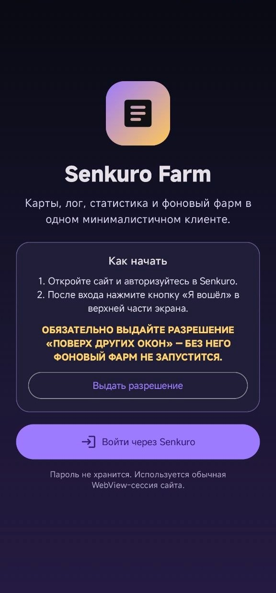
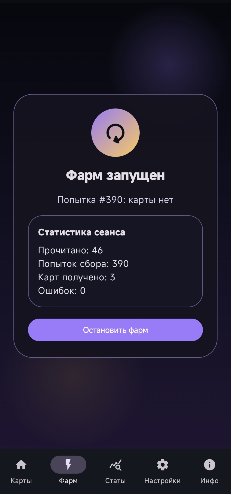
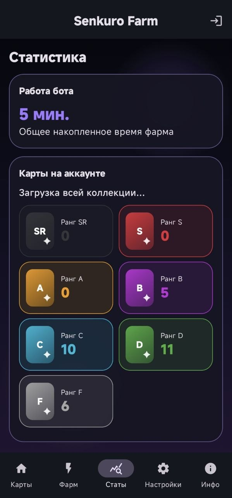
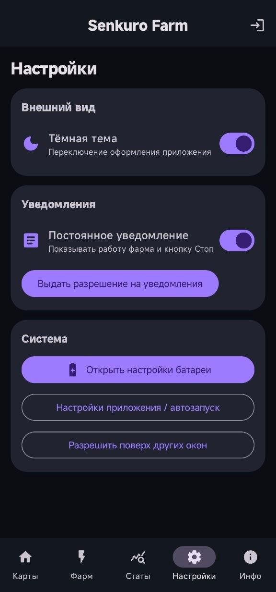

<div align="center">


# ⚡ Senkuro Farm

**Android-приложение для просмотра коллекции карт, статистики, автоматического сбора карт и поиска владельцев на сайте senkuro.me**

[](https://www.android.com/)
[](https://kotlinlang.org/)
[](https://github.com/Matvel007/SenkuroFarm/releases)
[](#-лицензия)

</div>

> [!IMPORTANT]
> Senkuro Farm — неофициальное приложение. Проект не связан с администрацией Senkuro. Используя приложение, вы самостоятельно отвечаете за соблюдение правил сайта.

> [!CAUTION]
> **⚠️ Осторожно: подражатели!**
>
> Обнаружен сайт **`gw-wl1.sytes.net`**, который использует нашу логику фарма в коммерческих целях — продаёт доступ к веб-панели и карты через Telegram-бота `@Senkuro_CyberBot`.
>
> Мы никак не связаны с этим проектом. **Настоятельно не рекомендуем** передавать им свои данные и пользоваться их услугами.
>
> Senkuro Farm — **бесплатное и открытое приложение**, работающее локально на вашем устройстве. Вы полностью контролируете свои данные.

## 📱 Скриншоты

<div align="center">
  
  
  
  
</div>

## ✨ Возможности

- 🃏 Просмотр коллекции карт аккаунта в удобной сетке.
- 💎 Корректное отображение обычных карт и осколков.
- 👥 Поиск владельцев карты/осколка на сайте — удобный обмен с другими игроками.
- 🎁 Автоматический сбор карт в выбранной книге.
- 🌙 Работа в фоне и при выключенном экране через `ForegroundService`.
- 📊 Статистика времени работы, коллекции по рангам и карт, собранных ботом.
- 🧠 Кэширование коллекции, книг и глав для быстрой и плавной работы.
- 🔔 Постоянное уведомление с состоянием фарма и кнопкой остановки.
- 🎨 Тёмное и светлое оформление на Jetpack Compose.
- 🔐 Авторизация через WebView — пароль приложением не сохраняется.
- 🔄 Встроенная проверка и установка обновлений из GitHub Releases с описанием новой версии и шкалой загрузки.

## 🚀 Установка

1. Скачайте APK из раздела **Releases**.
2. Разрешите установку приложений из выбранного источника.
3. Установите APK и запустите Senkuro Farm.

Минимальная версия системы — **Android 7.0 (API 24)**.

> [!NOTE]
> Первый APK устанавливается вручную. Следующие официальные версии приложение сможет находить и загружать самостоятельно.

## 📖 Использование

1. На стартовом экране нажмите **«Выдать разрешение»** если приложение попросит.
2. Нажмите **«Войти через Senkuro»**.
3. Авторизуйтесь на открывшемся сайте.
4. После успешного входа нажмите **«Я вошёл»** в верхней части экрана.
5. Откройте вкладку **«Фарм»**, выберите книгу и главу, нажмите **«Запустить»**.
6. Приложение продолжит работу в фоне. Остановить фарм можно внутри приложения или кнопкой в уведомлении.

> [!WARNING]
> На Xiaomi, Poco и некоторых эмуляторах рекомендуется разрешить автозапуск и отключить ограничения энергосбережения для приложения.

## 🧭 Разделы приложения

| Раздел | Назначение |
|---|---|
| 🏠 **Карты** | Коллекция аккаунта, ранги, количество карт и осколки |
| ⚡ **Фарм** | Выбор книги и главы, запуск автоматического сбора карт |
| 👥 **Владельцы карты** | Список других игроков с такой же картой/осколком для удобного обмена |
| 📈 **Статы** | Общее время работы и статистика карт |
| ⚙️ **Настройки** | Тема, уведомления, сброс статистики, батарея и системные разрешения |
| ℹ️ **Инфо** | Версия, проверка обновлений, лицензия и информация о проекте |

## 🛠️ Технологии

- Kotlin
- Jetpack Compose + Material 3
- Android WebView
- Foreground Service + WakeLock
- OkHttp
- Coil + animated image support
- SharedPreferences

## 🧑‍💻 Сборка из исходников

Понадобятся Android Studio, Android SDK и JDK 11 или новее.

```bash
git clone https://github.com/Matvel007/SenkuroFarm.git
cd SenkuroFarm
./gradlew assembleDebug
```

Debug APK появится здесь:

```text
app/build/outputs/apk/debug/app-debug.apk
```

Для release-сборки создайте собственный ключ подписи и файл `keystore.properties`. Ключи и пароли не должны попадать в Git.

## 🔒 Конфиденциальность

- Пароль пользователя не сохраняется приложением.
- Авторизация выполняется непосредственно в WebView сайта Senkuro.
- Сессионные cookies хранятся локально на устройстве.
- Приложение не передаёт учётные данные сторонним сервисам.

## ⚖️ Отказ от ответственности

Все права на название, торговые марки и контент Senkuro принадлежат их законным владельцам. Приложение использует доступный веб-интерфейс сайта и предоставляется «как есть», без гарантий стабильности или совместимости с будущими изменениями Senkuro.

## 📄 Лицензия

Исходный код распространяется на условиях [MIT License](LICENSE).

<div align="center">

Сделано для Android с использованием Kotlin и Jetpack Compose.

</div>
